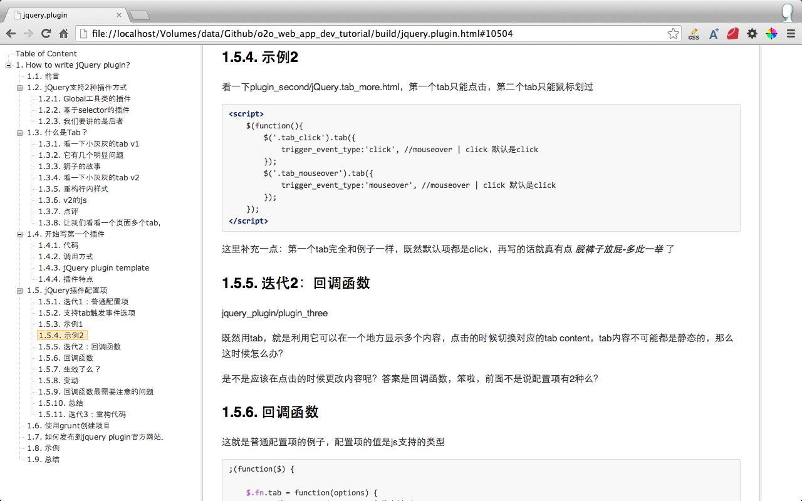
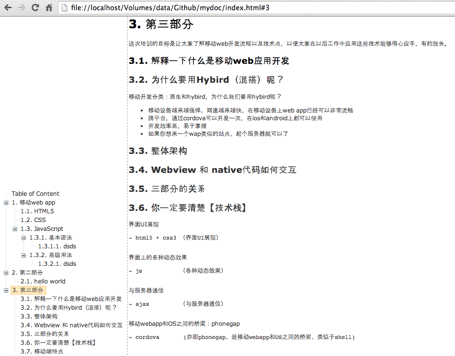

# jQuery.zTree_Toc.js

this is a jQuery plugin for preview  markdown table of content

Cli tools for compile markdown to html with jquery.ztree_toc.js

- [ruby版本tocmd](https://github.com/i5ting/tocmd.gem)
- [node版本i5ting_toc](https://github.com/i5ting/tocmd.npm)
- [zTree_Toc lite version](https://github.com/i5ting/markdown_toc)


<!--




 -->

## Usages

Add this line to your html file:

	<script type="text/javascript" src="js/jquery-1.4.4.min.js"></script>
	<script type="text/javascript" src="js/jquery.ztree.core-3.5.js"></script>
	<script type="text/javascript" src="jquery.ztree_toc.js"></script>

Add this line to your html file:

	 <link rel="stylesheet" href="../css/zTreeStyle/zTreeStyle.css" type="text/css">

And then execute:

	<SCRIPT type="text/javascript" >
	<!--
	$(document).ready(function(){
		$('#tree').ztree_toc({

		});
	});
	//-->
	</SCRIPT>

or use bower to install

## Example

@see demo/*.html

for example:

	$(document).ready(function(){
		$('#tree').ztree_toc({
			is_auto_number: true,
			// documment_selector: '.first_part'
		});
	});


## Online examples

- http://i5ting.github.io/msgpack-specification/
- http://i5ting.github.io/How-to-write-jQuery-plugin/
- https://github.com/i5ting/msgpack

## Build

	npm install -g grunt-cli
	grunt
	
console result

```
➜  i5ting_ztree_toc git:(master) ✗ touch build.sh
➜  i5ting_ztree_toc git:(master) ✗ grunt 
Running "qunit:files" (qunit) task
Testing test/index.html ...OK
>> 16 assertions passed (28ms)

Running "clean:files" (clean) task
Cleaning dist...OK

Running "concat:dist" (concat) task
File "dist/ztree_toc.js" created.

Running "uglify:dist" (uglify) task
File "dist/ztree_toc.min.js" created.

Done, without errors.
```

this plugin can be find in following ways:

- http://plugins.jquery.com/ztree_toc/
- bower install ztree_toc

## Contributing

1. Fork it
2. Create your feature branch (`git checkout -b my-new-feature`)
3. Commit your changes (`git commit -am 'Add some feature'`)
4. Push to the branch (`git push origin my-new-feature`)
5. Create new Pull Request

or @see at [CONTRIBUTING.md](CONTRIBUTING.md)

## History

- v0.4.1 fixed #7  使用标题作为anchor，感谢chanble和oldfeel
- v0.4.0 支持scroll selector配置可选，默认是window
- v0.3.0 支持ztree is position top和部分文档
- v0.2.0 支持正文滚动，同时更新ztree
- v0.1.0 初始化版本


@see at [History.md](History.md)

## Checklist

- Completely customizable documment selector: 'body' 自定义header文档位置，此处为jq的选择器（已完成）
- is_auto_number: false, 默认是否显示header编号（已完成）
- is_expand_all: true,默认是否展开全部（已完成）
- is_posion_top: true,默认是位于上部（已完成）
- is_highlight_selected_line是否对选中行，显示高亮效果（TODO）
- Click to smooth scroll to that spot on the page（TODO）
- Automatically highlight the current section（TODO）
- Extremely lightweight (2,963|1,514 bytes gzipped)（已完成）
- Can have multiple on a page（TODO）
- 正文移动，更新目录（已完成）
- 滚动动画（TODO）
- right click to config（TODO）
- 使用标题作为anchor，感谢 @chanble 和 @oldfeel（已完成）

## Welcome fork and feedback

在issue提问或邮件shiren1118@126.com

## License

this jQuery plugin is released under the [MIT License](http://www.opensource.org/licenses/MIT).
